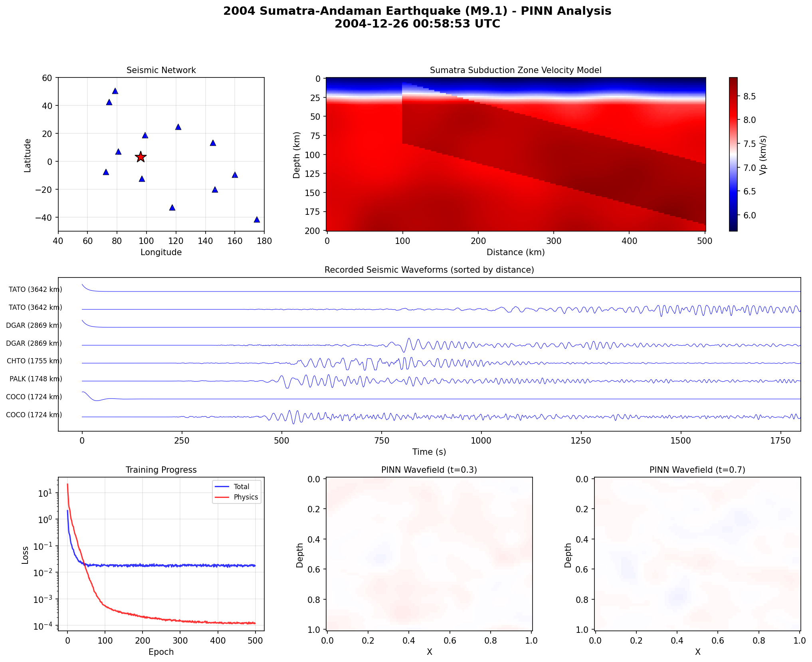

# Seismic Monitoring Lab

A research prototype combining physics-informed neural networks for seismic wave modeling, seismic-data adapters and a React visualization interface.

**Status:** experimental modeling and monitoring tools from December 2025. It is not a validated tsunami warning system and must not be used to make evacuation or emergency decisions.

## Recorded scenario



This existing artifact combines the 26 December 2004 Sumatra-Andaman event context, a velocity model, waveforms and PINN training/field plots. It is a saved experiment visualization, not a validated tsunami-arrival forecast or evidence of operational alert performance. The generating script is [train_sumatra_pinn.py](scripts/train_sumatra_pinn.py).

## What the components do

| Component | Scope |
|---|---|
| `src/models/`, `src/physics/`, `src/training/` | PINN architectures, wave-equation losses and training |
| `src/data/` | Seismic-data loading, velocity models and synthetic-data generators |
| `src/api/` | Training/inference, data and streaming endpoints |
| `frontend/` | React visualizations and experiment controls |

Live-feed adapters depend on external services and network availability. Synthetic wavefields and modeled outputs are distinct from observed waveforms. A model checkpoint must be available before model-backed inference is established.

## Local setup

```bash
git clone https://github.com/anudeepadi/seismic-monitoring-lab.git
cd seismic-monitoring-lab
python -m venv .venv
source .venv/bin/activate
python -m pip install -r requirements.txt
uvicorn src.api.main:app --reload --port 8000
```

In another terminal from the repository root:

```bash
cd frontend
npm ci
npm run dev
```

See [configs/default.yaml](configs/default.yaml) for the training configuration and [scripts/train.py](scripts/train.py) for supported training arguments. External data downloads, training and live-feed acceptance were not rerun during this documentation update.

## Validation still needed

Evaluate model residuals and waveform error against a numerical/reference baseline on held-out scenarios. Record velocity assumptions, source/boundary conditions, data provenance, checkpoint, hardware and timing. A decreasing training loss alone is insufficient to claim correct wave propagation, tsunami prediction or reliable alerting. The public interface and historical screenshots should be read within that research scope.

## License and credits

The original README identifies MIT licensing; no standalone LICENSE file is included in this checkout. Original acknowledgments name IRIS, USGS, NOAA, ObsPy and Mapbox. These credits are retained; they do not imply endorsement or operational certification.
